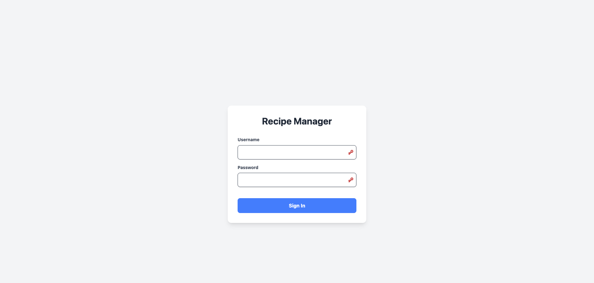
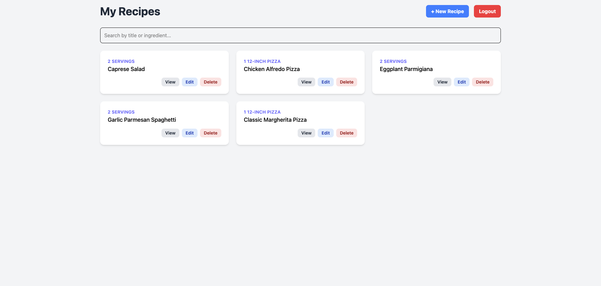
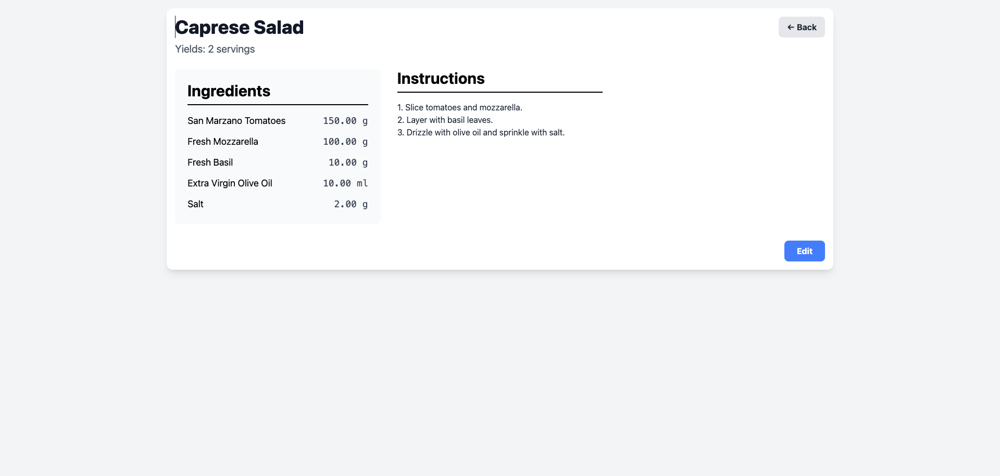

# Recipe Management System: Design & Architecture Document

This document outlines the architecture and design decisions for the Recipe Management System. 
---

## 1. High-Level Architecture

A **Monolithic Architecture** 
> Given the specified scale (up to 1,000 recipes and 5,000–10,000 daily requests), a microservices architecture would introduce unnecessary complexity in development, deployment, and operational overhead. A monolith provides a simpler, more direct path to a robust solution.

**The system is composed of three primary layers:**

- **Backend (API Server):**  
  A single Django application that serves a RESTful API. It handles all business logic, database interactions, and authentication.

- **Frontend (Client):**  
  A dynamic Single Page Application (SPA), likely built with a modern JavaScript framework like React, that consumes the backend API.

- **Database:**  
  A relational database (SQLite for development, PostgreSQL for production) that persists all application data.

---

## 2. Backend Design

The backend is the core of the system, providing all data and functionality through a RESTful API.

- **Language/Framework:** Python with the Django REST Framework
- **Database:** SQLite (development) / PostgreSQL (production)
- **Authentication:** JSON Web Tokens (JWT) via `djangorestframework-simplejwt`

### Data Models

The data is structured across five main models to ensure data integrity and support multi-tenancy:

- **Restaurant:**  
  The top-level model for tenancy. Every other key piece of data is linked to a restaurant.  
  - `name`: CharField

- **UserProfile:**  
  Links a standard Django User to a Restaurant, forming the basis of our authorization logic.  
  - `user`: OneToOneField to User  
  - `restaurant`: ForeignKey to Restaurant

- **Recipe:**  
  The central model for a recipe. It is directly owned by a Restaurant.  
  - `title`, `instructions`, `yield_amount`: CharField/TextField  
  - `restaurant`: ForeignKey to Restaurant

- **Ingredient:**  
  A global list of available ingredients to avoid duplication.  
  - `name`: CharField

- **RecipeIngredient:**  
  A "through" model that links a Recipe to an Ingredient and stores the quantity and unit for that specific relationship.

#### Further Considerations
- If we need to support multiple restaurant chains
- Use an "updated at" field to track who last modified recipes
- Allow multiple users within a restaurant to own different recipes

### API Endpoints

The API is versioned and served under the `/api/` prefix.

| Method | Endpoint           | Description                                         |
|--------|--------------------|-----------------------------------------------------|
| POST   | `/token/`          | Obtain a JWT access and refresh token pair.         |
| POST   | `/token/refresh/`  | Refresh an expired JWT access token.                |
| GET    | `/recipes/`        | List all recipes for the authenticated restaurant.  |
| POST   | `/recipes/`        | Create a new recipe for the user's restaurant. Can be filtered with ?search=term.|
| GET    | `/recipes/{id}/`   | Retrieve a specific recipe.                         |
| PUT/PATCH | `/recipes/{id}/`| Fully or partially update a specific recipe.        |
| DELETE | `/recipes/{id}/`   | Delete a specific recipe.                           |

---

## 3. Frontend Design

The frontend is a decoupled Single Page Application (SPA).

- **Framework:** React is recommended due to its component-based architecture and vast ecosystem, which is ideal for creating a dynamic user interface.
- **State Management:** React's built-in Context API is sufficient for managing global state like the authenticated user and their JWT token.

### Key Components

- **RecipeList:** Displays cards for each recipe.
- **RecipeDetail:** A view optimized for kitchen use with large fonts and clear, step-by-step instructions.
- **RecipeForm:** A controlled form for creating and editing recipes, including dynamic fields for adding ingredients.
- **Login:** A simple form to submit credentials to the `/api/token/` endpoint.
- **Dashboard:** - A user restaurant landing page

---

## 4. Design Considerations & Decisions

Several key decisions were made to balance the project's requirements with best practices for maintainability, cost, and scalability.

### Monolith vs. Microservices

- **Decision:** Chose a monolithic architecture.
- **Reasoning:**  
  The project's scale does not justify the complexity of a microservices setup. A monolith is faster to develop, easier to test end-to-end, and simpler to deploy and manage, directly contributing to lower operational costs and maintenance overhead.

### Choice of Python & Django

- **Decision:** Use Python with the Django REST Framework.
- **Reasoning:**  
  - **Developer Productivity:** Python's clean syntax and Django's "batteries-included" philosophy accelerate development. Features like the built-in ORM, automatic admin panel, and security middleware (CSRF, XSS protection) come out of the box.
  - **Maintainability:** Django's enforced project structure (models, views, serializers) leads to organized, readable, and maintainable code.
  - **Ecosystem:** The combination of Django, Django REST Framework, and Simple JWT is a mature, well-documented, and powerful stack for building robust REST APIs.

### Cost-Effectiveness

- **Decision:** Use an entirely open-source stack and design for simple deployment.
- **Reasoning:**  
  Using Python, Django, and PostgreSQL incurs no licensing fees. The monolithic architecture is simple enough to be deployed on a single, affordable cloud server (e.g., a single Heroku dyno, AWS EC2 instance, or DigitalOcean droplet), minimizing infrastructure costs.

### Testability

- **Decision:** Structure the code to be highly testable using Django's built-in tools.
- **Reasoning:**  
  The separation of concerns within Django allows for focused unit tests (for models and serializers) and integration tests (for API views). The provided `tests.py` demonstrates this by using `APITestCase` to test authentication, CRUD operations, and, most importantly, the multi-tenancy rules, ensuring the system is reliable.

---

## Locally use run-script.sh
```bash
chmod +x run-script.sh

./run-script.sh
```

## Deployment at 
https://lab37-frontend.vercel.app/

Username - chef_tony
Password - password123

## Screenshots




##### Use of Gemini Pro, Cursor for code generation and rewriting docs